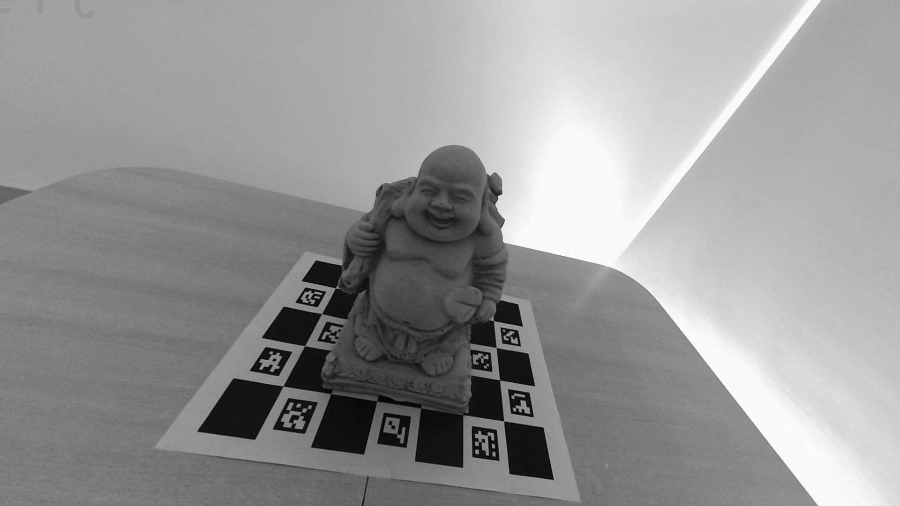
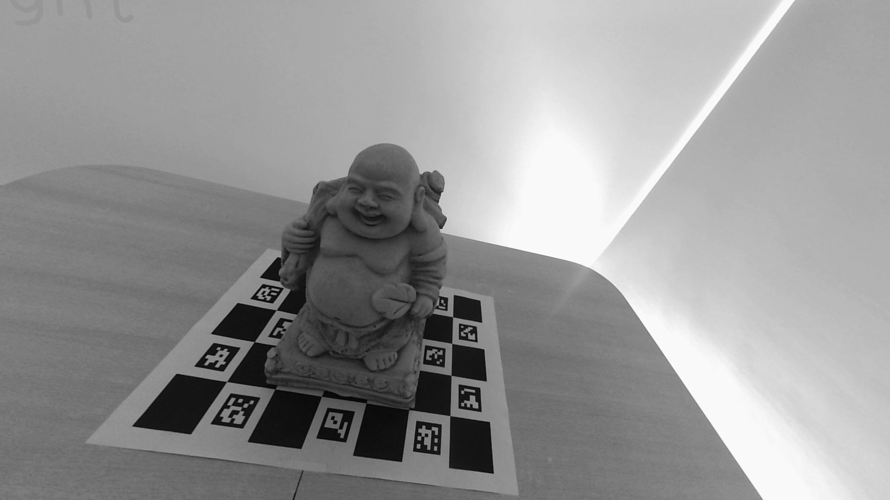

# TP2 · Reconstrucción 3D estéreo · Visión Artificial (I308)

Reconstrucción 3D de una escena a partir de un par de imágenes estéreo: desde la calibración de las cámaras hasta la generación y refinamiento de la nube de puntos.

> Trabajo práctico de **I308 – Visión Artificial** (Universidad de San Andrés). Informe completo en `Informe_tp2.pdf`.

## Par estéreo de entrada

| Izquierda | Derecha |
|-----------|---------|
|  |  |

## Pipeline

1. **Calibración** de cámaras con patrón **ChArUco** (`utils/charuco_utils.py`) → intrínsecos y distorsión.
2. **Mapa de disparidad**, con dos métodos intercambiables (`utils/disparity/`):
   - **CREStereo** — modelo de deep learning (ONNX) para disparidad densa.
   - **OpenCV Block Matching** — método clásico como comparación.
3. **Profundidad a partir de disparidad** (`utils/depth_from_disp_utils.py`).
4. **Nube de puntos 3D** (`utils/stereo_pcd_utils.py`), con:
   - **limpieza** de outliers (`utils/pc_cleaning.py`)
   - **refinamiento por ICP** (`utils/icp_refine.py`)

## Estructura

| Ruta | Contenido |
|------|-----------|
| `calib_recti.ipynb` | Notebook principal (calibración, rectificación, disparidad, reconstrucción) |
| `utils/` | Módulos del pipeline (calibración, disparidad, profundidad, nube de puntos) |
| `utils/disparity/` | Métodos de disparidad (CREStereo y OpenCV BM) |
| `models/` | Modelo CREStereo (`.onnx`) |
| `code_examples/` | Ejemplos de calibración ChArUco y disparidad |

## Tecnologías

Python · OpenCV · Open3D · ONNX Runtime · NumPy
